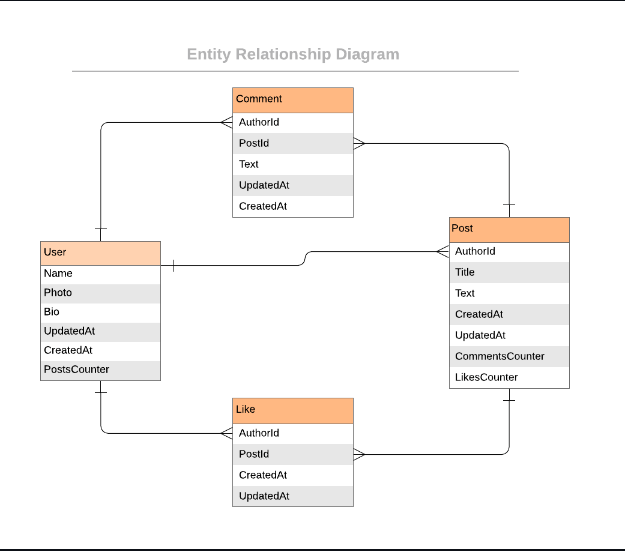

# Blog App

> The Blog app is a classic example of a blog website. It is a fully functional website that will show the list of posts and empower readers to interact with them by adding comments and liking posts.

## Diagram

## Built With
- Ruby
- Gem
- Terminal
- PostgresSQL
- RSpec

## To get a local copy run the following steps:
- Open your terminal or command line
- Run git clone [link](https://github.com/Tufahel/blog-app)
- Open the folder with your code editor
- Create a branch to work on

## To get started:
  - Run `bundle install` to install the dependencies
  - Run `irb` to run the code by pasting it in the terminal.
  - run `rspec spec` to test the files.
  - Run `rubocop` to find and fix linters

## Author

👤 **Tufahel Ahmed**

- GitHub: [@Tufahel](https://github.com/Tufahel)
- Twitter: [@TufahelAhmed](https://twitter.com/TufahelAhmed)
- LinkedIn: [@Tufahel-Ahmed](https://www.linkedin.com/in/tufahel-ahmed/)

## 🤝 Contributing

Contributions, issues, and feature requests are welcome!

Feel free to check the [issues page](https://github.com/Mwapsam/ruby-capstone/issues)

## Show your support

Give a ⭐️ if you like this project!

## 📝 License
This project is [MIT](https://github.com/microverseinc/readme-template/blob/master/MIT.md) licensed.

